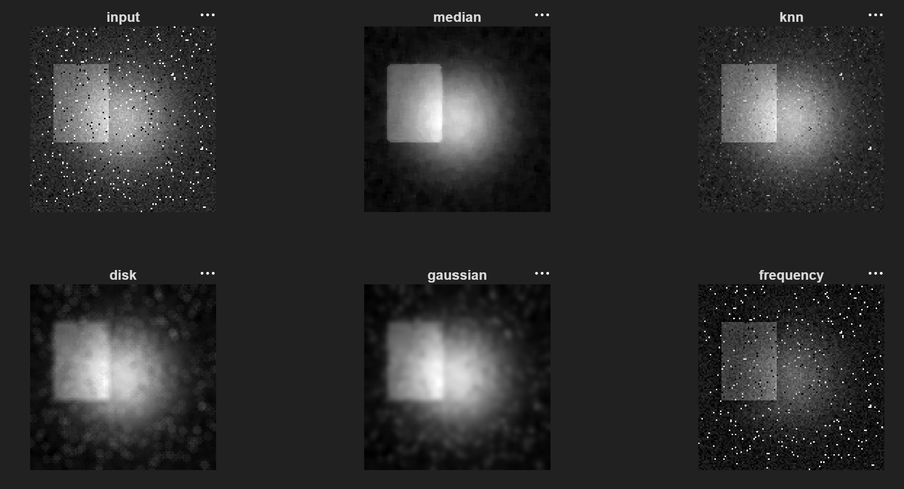

# Digital Image Processing Toolkit

A modular MATLAB toolkit that implements spatial-domain filtering, linear transforms, circular convolution, and frequency-domain image processing from first principles.

The project consolidates four digital image-processing assignments into one configurable and reusable toolkit. Core algorithms are implemented without MATLAB’s built-in filtering or FFT functions to demonstrate the underlying mathematics and computational tradeoffs.

## Example Results

The toolkit applies several spatial- and frequency-domain operations to the same noisy grayscale image.



The example demonstrates:

* Median filtering for strong impulse-noise removal
* K-nearest-neighbor filtering for improved edge preservation
* Cylindrical/disk point-spread-function filtering
* Separable Gaussian filtering
* Frequency-domain high-emphasis filtering

## Features

### Nonlinear spatial filtering

* Configurable median filter
* K-nearest-neighbor mean filter
* Reflection-based boundary handling
* Adjustable neighborhood size and neighbor count

### Linear spatial filtering

* Normalized cylindrical/disk point-spread function
* Direct two-dimensional spatial convolution
* Normalized Gaussian point-spread function
* Separable Gaussian filtering using horizontal and vertical passes
* Configurable radius, standard deviation, and kernel size

### Linear transforms and convolution

* General two-dimensional linear transform
* Separable linear transform
* Direct circular convolution
* Separable circular convolution
* Modular wraparound indexing

### Frequency-domain processing

* Forward two-dimensional DFT using explicit complex transform matrices
* Inverse two-dimensional DFT using explicit complex transform matrices
* No calls to `fft2` or `ifft2`
* Configurable frequency cutoff and low-frequency gain
* Unshifted frequency representation with low frequencies wrapping across the four corners
* Saved DFT magnitude, filtered magnitude, and frequency-mask visualizations

### Verification

* DFT/IDFT reconstruction testing
* Kernel-normalization testing
* Output-dimension and finite-value checks
* Direct-versus-separable linear-transform comparison
* Direct-versus-separable circular-convolution comparison
* Frequency-mask verification

## Repository Structure

```text
digital-image-processing-toolkit/
├── docs/
│   └── images/
│       └── filter-comparison.png
├── filters/
│   ├── cylindricalFilterCustom.m
│   ├── frequencyHighEmphasis.m
│   ├── gaussianSeparableCustom.m
│   ├── knnMeanFilterCustom.m
│   └── medianFilterCustom.m
├── transforms/
│   ├── circularConvolution2D.m
│   ├── dft2Matrix.m
│   ├── directSpatialConvolution.m
│   ├── generalLinearTransform.m
│   ├── idft2Matrix.m
│   ├── separableCircularConvolution.m
│   └── separableLinearTransform.m
├── utilities/
│   ├── readGrayscaleImage.m
│   ├── reflectIndex.m
│   └── saveImageResult.m
├── tests/
│   └── runTests.m
├── sample_images/
│   └── input.jpg
├── example.m
├── runToolkit.m
├── README.md
├── LICENSE
└── .gitignore
```

## Requirements

* MATLAB R2021b or newer
* MATLAB Image Processing Toolbox

The Image Processing Toolbox is used for image loading, grayscale conversion, resizing, display, and saving. The filtering, convolution, and DFT algorithms are implemented by the toolkit.

This project was tested successfully using MATLAB R2024b.

## Getting Started

### 1. Clone the repository

```bash
git clone https://github.com/OwenCallen1/digital-image-processing-toolkit.git
cd digital-image-processing-toolkit
```

Alternatively, download the repository as a ZIP and extract it.

### 2. Open the project in MATLAB

Set MATLAB’s Current Folder to the repository root, then add all project directories to the MATLAB path:

```matlab
addpath(genpath(pwd));
```

### 3. Add an input image

Place a grayscale or RGB image in:

```text
sample_images/
```

For the default example, name it:

```text
input.jpg
```

RGB images are automatically converted to grayscale.

### 4. Run the demonstration

```matlab
example
```

The demonstration applies every major filter, displays the comparison figure, and saves the generated outputs.

## Running the Complete Toolkit

`runToolkit.m` is a function, so it requires an input-image path and should not be executed by pressing the MATLAB Run button without arguments.

Use:

```matlab
results = runToolkit( ...
    "sample_images/input.jpg", ...
    "results");
```

The returned `results` structure contains:

```matlab
results.input
results.median
results.knn
results.cylindrical
results.cylindricalKernel
results.gaussian
results.gaussianKernel
results.frequencyFiltered
results.spectrum
results.filteredSpectrum
results.frequencyMask
```

## Configuring the Toolkit

All important parameters can be changed through an options structure:

```matlab
options = struct( ...
    "medianWindow", 5, ...
    "knnWindow", 3, ...
    "knnK", 4, ...
    "cylinderRadius", 3, ...
    "cylinderKernelSize", 11, ...
    "gaussianSigma", 2, ...
    "gaussianKernelSize", 21, ...
    "frequencyCutoff", 10, ...
    "lowFrequencyGain", 0.5, ...
    "resizeTo", [], ...
    "displayFigures", true);

results = runToolkit( ...
    "sample_images/input.jpg", ...
    "results", ...
    options);
```

Set `resizeTo` to an empty array to preserve the original image dimensions:

```matlab
"resizeTo", []
```

To request an exact image size, provide the number of rows and columns:

```matlab
"resizeTo", [256 256]
```

## Using Individual Algorithms

Each algorithm can also be called independently.

### Read an image

```matlab
image = readGrayscaleImage("sample_images/input.jpg");
```

### Median filter

```matlab
medianOutput = medianFilterCustom(image, 5);
```

### K-nearest-neighbor filter

```matlab
knnOutput = knnMeanFilterCustom(image, 3, 4);
```

### Cylindrical/disk filter

```matlab
[cylindricalOutput, cylindricalKernel] = ...
    cylindricalFilterCustom(image, 3, 11);
```

### Separable Gaussian filter

```matlab
[gaussianOutput, gaussianKernel] = ...
    gaussianSeparableCustom(image, 2, 21);
```

### Direct spatial convolution

```matlab
kernel = ones(3, 3) / 9;
convolutionOutput = directSpatialConvolution(image, kernel);
```

### Forward and inverse DFT

```matlab
spectrum = dft2Matrix(image);
reconstruction = idft2Matrix(spectrum);
reconstruction = real(reconstruction);
```

### Frequency-domain high-emphasis filtering

```matlab
[filteredImage, spectrum, filteredSpectrum, mask] = ...
    frequencyHighEmphasis(image, 10, 0.5);
```

## Running the Tests

From the repository root, run:

```matlab
addpath(genpath(pwd));
runTests;
```

A successful run prints:

```text
All Digital Image Processing Toolkit tests passed.
```

The automated test suite verifies:

* Median and KNN output dimensions
* Cylindrical-kernel normalization
* Gaussian-kernel normalization
* Finite spatial-filter outputs
* DFT followed by IDFT reconstructs the original matrix
* Separable linear transforms match their matrix-multiplication form
* Separable circular convolution matches direct circular convolution
* Frequency filtering returns a valid output and the requested mask values

## Algorithms and Complexity

Let:

* `M × N` represent the image dimensions
* `W × W` represent a nonlinear-filter neighborhood
* `K × K` represent a spatial kernel

| Algorithm            | Implementation                       | Approximate complexity |
| -------------------- | ------------------------------------ | ---------------------: |
| Median filter        | Sort each reflected neighborhood     |     `O(MN W² log(W²))` |
| KNN mean filter      | Sort neighbors by intensity distance |     `O(MN W² log(W²))` |
| Cylindrical blur     | Direct 2D convolution                |             `O(MN K²)` |
| Gaussian blur        | Two separable 1D passes              |              `O(MN K)` |
| Circular convolution | Direct wraparound convolution        |              `O(M²N²)` |
| Matrix DFT/IDFT      | Separable matrix multiplication      |         `O(M²N + MN²)` |

Separable Gaussian filtering reduces the computation required by a full two-dimensional kernel from approximately `K²` operations per pixel to `2K` operations per pixel.

## Implementation Details

### Reflection boundary handling

The nonlinear and spatial filters use reflection at image boundaries. Reflection avoids accessing invalid indices while limiting the artificial discontinuities that zero padding can introduce.

Boundary handling is centralized in:

```text
utilities/reflectIndex.m
```

### Kernel normalization

The cylindrical and Gaussian kernels are normalized so their coefficients sum to one. This helps preserve the overall brightness of the image after filtering.

### Separable Gaussian filtering

The Gaussian filter is applied in two stages:

1. Horizontal one-dimensional filtering
2. Vertical one-dimensional filtering

This produces the same mathematical operation as applying the equivalent separable two-dimensional Gaussian kernel while requiring fewer computations.

### Matrix-based DFT

The toolkit constructs complex-valued transform matrices and computes the DFT as:

```matlab
F = P * f * Q;
```

The inverse transform is computed using the corresponding inverse matrices:

```matlab
f = P_inverse * F * Q_inverse;
```

This implementation is intended to expose the mathematics of the DFT. For production-scale processing, MATLAB’s FFT implementation is substantially faster.

### Frequency-domain filtering

The high-emphasis filter attenuates low spatial frequencies by a configurable gain while leaving other frequency components unchanged.

Because the DFT is not shifted, the low-frequency region wraps across the corners of the frequency-domain representation.

## Output Files

The complete pipeline saves:

```text
original.png
median.png
knn.png
cylindrical.png
gaussian.png
frequency_filtered.png
frequency_mask.png
dft_magnitude.png
filtered_dft_magnitude.png
```

Generated results are stored in the selected output directory.

## Project Motivation

This project began as four digital image-processing assignments covering nonlinear filters, linear transforms, spatial convolution, and frequency-domain filtering.

The implementations were consolidated and refactored into one reusable toolkit by:

* Removing hard-coded image paths and dimensions
* Converting scripts into parameterized functions
* Centralizing shared boundary-handling logic
* Adding input validation and informative errors
* Creating a unified demonstration pipeline
* Adding automated numerical tests
* Documenting algorithmic complexity and implementation tradeoffs
* Organizing the code into a GitHub-ready repository

## Limitations

* The matrix-based DFT is computationally expensive for large images.
* The current pipeline operates on grayscale images.
* The implementations prioritize clarity and educational value over production-level performance.
* The KNN filter compares neighborhood intensities with the center pixel; it is not a machine-learning classifier.
* Very large filter kernels increase the runtime of direct spatial convolution.

## Potential Improvements

Future extensions could include:

* PSNR, SSIM, and MSE measurements
* Runtime benchmarking across image and kernel sizes
* Comparisons against MATLAB reference implementations
* RGB image-processing support
* Additional noise models
* Additional low-pass, high-pass, and band-pass frequency responses
* FFT-based processing for larger images
* A graphical interface for interactive parameter selection
* A C++ or Python port for cross-language performance comparisons

## Author

**Owen Callen**
Computer Engineering
Stony Brook University

GitHub: [OwenCallen1](https://github.com/OwenCallen1)

## License

This project is licensed under the MIT License. See [LICENSE](LICENSE) for details.
